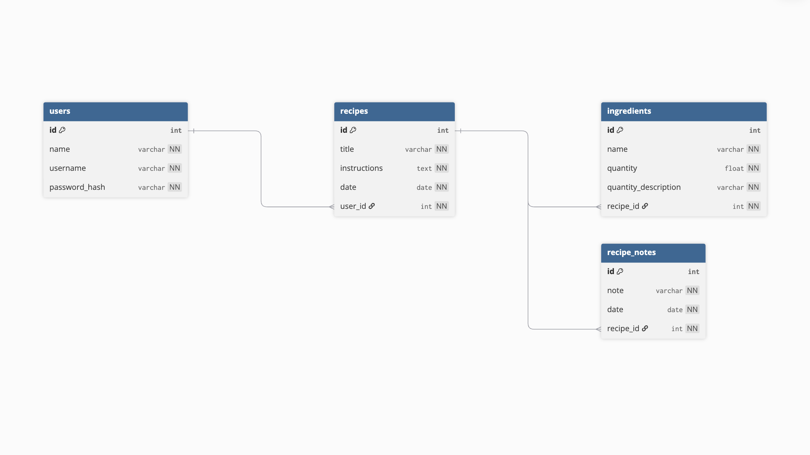

# Meal and Grocery Planner
My fullstack app with a Python Flask backend and React frontend makes meal planning and grocery shopping simple and stress-free. <br>
Features:
* Create custom recipes and add to your calendar
* Don't want to make your own recipe? Add recipes from a url
* Browse your saved recipes and add to your calendar again
* View or edit any recipe on your calendar
* Automatically generate a weekly grocery list based on planned dishes 

## Skills Practiced
* User authentication with JSON Web Tokens (JWT)
* Model and schema validations
* use of Firecrawl API
* React router
* Full CRUD functionality
* Connecting a flask backend to a react frontend
* Deploying the webpage

## Models/Tables


## Database
Postgres through Neon <br>
https://neon.com/

## Endpoints
* ` POST /signup` <br>
Allow users to create an account
* `POST /login` <br>
Users can login to their account by entering their username and password <br>
JSON Web Token created upon login
* `GET /me` <br>
Returns the user if the user is logged in 
* `GET /api/recipes` <br>
Get all recipes <br>
User's can only view their own recipes, verified with their JWT
* `POST /api/recipes` <br>
Users can create a recipe
* `GET /api/recipes/<int:recipe_id>` <br>
Get one recipe by the recipe id 
* `PATCH /api/recipes/<int:recipe_id>` <br>
User's can edit their own recipe
* `DELETE /api/recipes/<int:recipe_id>` <br>
User's can delete one of their recipes
* `POST /api/recipes/<int:recipe_id>/ingredients` <br>
Create an ingredient (associated with a recipe)
* `PATCH /api/recipes/<int:recipe_id>/ingredients/<int:id>` <br>
Edit an ingredient (user's can only edit their own)
* `DELETE /api/recipes/<int:recipe_id>/ingredients/<int:id>` <br>
User's can delete an ingredient associated with one of their recipes
* `POST /api/recipes/<int:recipe_id>/notes` <br>
Create a recipe note (associated with a recipe)
* `PATCH /api/recipes/<int:recipe_id>/notes/<int:id>` <br>
Edit a recipe note (user's can only edit their own)
* `DELETE /api/recipes/<int:recipe_id>/notes/<int:id>` <br>
User's can delete one of their recipe notes
* `POST /scrape-recipe` <br>
Firecrawl API, retreives recipe data from a url


## Getting Started
* Clone the repo onto your machine
  ```bash
  git clone <your-repo-url>
  cd <your-project-directory>
  ```
  ### Backend
* Create a virtual environment
  ```bash
  cd server
  virtualenv venv
  source venv/bin/activate
  ```
* Install necessarry dependencies
  ```bash
  (in server directory)
  pip install -r requirements.txt
  ```
  ### Set up .env.local file
* Add a database url to the .env.local file 
  - create new project in Neon
  - click on `Connect`
  - click on the .env tab and copy the `DATABASE_URL`
  - paste it into .env.local file <br>
  <br>
* Create a JSON Web Token Secret Key (can be anything) and paste into .env.local file <br>
<br>

* Get an api key from firecrawl API and paste into .env.local file (https://www.firecrawl.dev) 
  - go to the pricing tab
  - click "get started" on the free option
  - go to "profile & API Key"
  - copy your personal API key and paste into .env.local file <br>
  <br>

* Change the name of .env.local file to .env so that your keys will be secure
* Run migration and seed the database (seeding is optional, you will be able to make your own account and add your own data in the application)
  ```bash
  (must be in the server directory)
  flask db migrate
  flask db upgrade head
  python seed.py (optional)
  ```
* Starting the backend server
  ```bash
  (from the server directory) 
  python app.py
  ```
  ### Frontend
* install necessarry dependencies
  (in a second terminal)
  ```bash
  cd client
  npm install
  ```
* Starting the frontend
  ```bash
  (from the client directory and separate terminal from the backend server)
  npm run dev 
  ```
* Copy the localhost link into your browser to view and interact with the application <br>
http://localhost:5173/

### View Deployed Webpage:
https://plate-and-pantry-frontend.onrender.com/
